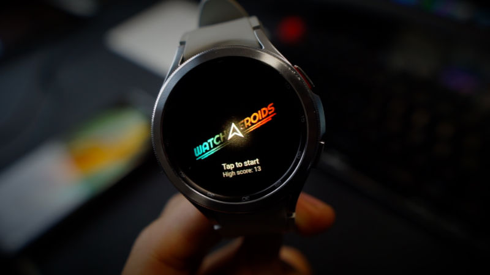

# Watchsteroids

The open source version of an Asteroids-ish game made for WearOS using the Flame Engine and Flutter.


<a href='https://play.google.com/store/apps/details?id=gg.renan.watchsteroids&pcampaignid=pcampaignidMKT-Other-global-all-co-prtnr-py-PartBadge-Mar2515-1'></a>


Project initially generated with the [Very Good CLI](https://cli.vgv.dev/).

Using Flame Engine on top of [Flutter](https://flutter.rip).

Score and game state is managed by the [Bloc library](https://bloclibrary.dev).

## Bear 🐻 with me

This code was written on a ridiculous rush, since I challenged myself to start and finish it within 
a weekend. There are almost no tests, few docs and the code could be better organized. This is not 
how good software should be made, but it is okay for this gimmick (I guess).

See my tweet about this [here](https://twitter.com/reNotANumber/status/1614990869685497857).

## Running:

- See how to run on a watch device here: 
- This also runs on android devices, but it's not optimized for it.

This project contains 3 flavors:

- development
- staging
- production

To run the desired flavor either use the launch configuration in VSCode/Android Studio or use the following commands:

```sh
# Development
$ flutter run --flavor development --target lib/main_development.dart

# Staging
$ flutter run --flavor staging --target lib/main_staging.dart

# Production
$ flutter run --flavor production --target lib/main_production.dart
```

